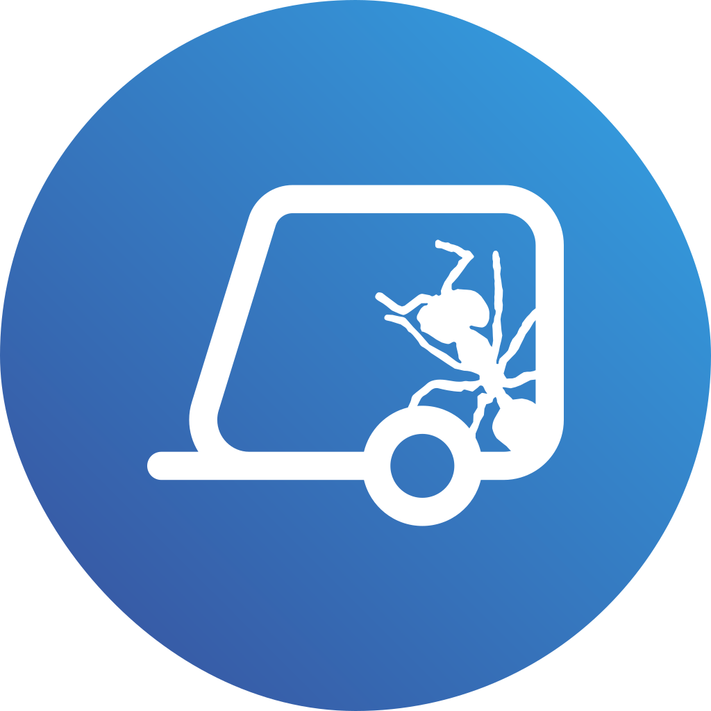

    
     
    <h1 align="center">Mi Roulotte</h1>
    

        Mi Roulotte es una página web que creé en 2017, cuando tenía tan solo 14 años, después de embarcarnos en nuestro primer viaje largo a través de Francia. Fue durante esta aventura que nació la idea de compartir nuestras experiencias y descubrimientos a través de un espacio en línea. Desde entonces, Mi Roulotte se ha convertido en un lugar donde capturo y comparto mis recuerdos de viajes, inspirando a otros a explorar y disfrutar del mundo que nos rodea. Te invito a unirte a este viaje virtual y sumergirte en las maravillosas historias y momentos que he experimentado a lo largo de los años.
    

    <h3>¡Nos vemos en la carretera!</h3>
    <a href="https://miroulotte.es" target="_blank">miroulotte.es</a>

 <a href="miroulotte.es" target="_blank">Mi Roulotte</a> por Alejandro Diez Bermejo se distribuye bajo una <a rel="license" href="http://creativecommons.org/licenses/by-nc-sa/4.0/">Licencia Creative Commons Atribución-NoComercial-CompartirIgual 4.0 Internacional</a>.

© 2025 | Alejandro Diez Bermejo
